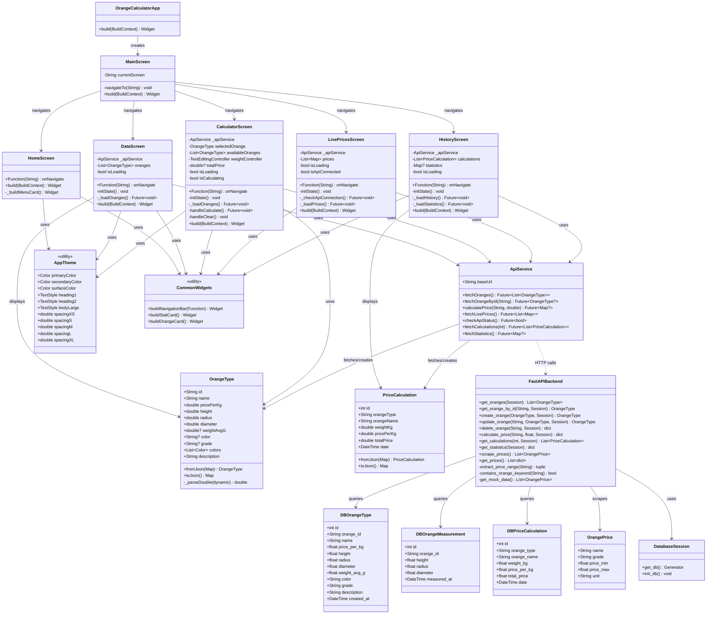

# Class Diagram - Orange Calculator App



## Class Descriptions

### Frontend (Flutter/Dart)

#### Application Layer
- **OrangeCalculatorApp**: Main application entry point, sets up MaterialApp and theme
- **MainScreen**: Root navigation screen managing screen transitions

#### Model Layer
- **OrangeType**: Domain model representing orange variety with properties and measurements
- **PriceCalculation**: Domain model for price calculation history records

#### Service Layer
- **ApiService**: HTTP client service for communicating with FastAPI backend
  - Handles API calls, error handling, and fallback to local data
  - Manages network requests and response parsing

#### Presentation Layer (Screens)
- **HomeScreen**: Landing page with navigation menu
- **DataScreen**: Displays list of orange varieties with details
- **CalculatorScreen**: Price calculation interface with orange selection and weight input
- **LivePricesScreen**: Real-time price display from web scraping
- **HistoryScreen**: Shows calculation history and statistics

#### Utility Layer
- **AppTheme**: Centralized theme configuration (colors, text styles, spacing)
- **CommonWidgets**: Reusable UI components (navigation bar, cards)

### Backend (FastAPI/Python)

#### Database Models
- **DBOrangeType**: SQLAlchemy model for orange varieties stored in database
- **DBOrangeMeasurement**: Physical measurements of oranges
- **DBPriceCalculation**: Calculation history records

#### API Models
- **OrangePrice**: Pydantic model for scraped price data from Talaadthai.com

#### API Layer
- **FastAPIBackend**: REST API endpoints
  - CRUD operations for oranges
  - Price calculation endpoint
  - Web scraping functionality
  - Statistics and history endpoints
- **DatabaseSession**: Database connection and session management

## Key Design Patterns

1. **Repository Pattern**: ApiService acts as repository for data access
2. **MVC Pattern**: Separation of Models, Views (Screens), and Controllers (State)
3. **Singleton**: ApiService instances
4. **Factory Pattern**: fromJson() methods for object creation
5. **Fallback Pattern**: Local data fallback when API unavailable
6. **RESTful API**: HTTP methods for CRUD operations

## Data Flow
```
Flutter UI → ApiService → HTTP Request → FastAPI Backend → SQLite Database
         ←              ← JSON Response ←                 ← Query Result
```
