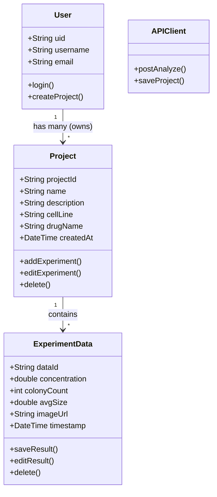

# Class Diagram - Orange Calculator App

## 2.1.4. Class Diagram

### 2.1.4.1. User
คลาสสำหรับจัดการข้อมูลผู้ใช้งาน รองรับแนออกสำหรับจัดการชื่ออื่น (login), ลงทะเบียน (register) และเริ่มสร้างโปรเจกต์ใหม่ (createProject)

### 2.1.4.2. Project
คลาสคลัทที่เป็นหัวใจหลวยของโครงการวิจัย 1 โครงการ เก็บข้อมูลสำคัญเช่น ชื่อโปรเจกต์ (name), ชื่อยา (drugName), และชื่อเซลล์ (cellLine) โดยมีความสัมพันธ์กับ แบบ Composition กับ AnalysisResult (โปรเจกต์ของมีผลลัพธ์)

### 2.1.4.3. AnalysisResult
คลาสสำหรับเก็บผลคำนวณหรือการวิเคราะห์จาก AI เช่น จำนวนเซลล์ (colonyCount) และขนาด (maxLength) รวมถึงมืออธิบายว่าถูกแก้ไขด้วยตนเอง (manualEdit)

### 2.1.4.4. APIClient
คลาส Service ที่ทำหน้าที่เชื่อมต่อกับ Backend เพื่อส่งข้อมูลไปประมวลผล (postAnalyze) และบันทึกที่ข้อมูล (saveProject)



## Class Descriptions

### Frontend (Flutter/Dart)

#### Model Layer
- **User**: คลาสจัดการข้อมูลผู้ใช้งาน สำหรับ login, register และสร้างโปรเจกต์
- **Project**: คลาสหลักของโครงการวิจัย เก็บข้อมูลโปรเจกต์ ชื่อยา และชื่อเซลล์
- **ExperimentData**: คลาสเก็บข้อมูลการทดลองและผลลัพธ์จาก AI analysis

#### Service Layer
- **APIClient**: Service สำหรับเชื่อมต่อกับ Backend
  - postAnalyze(): ส่งข้อมูลไปวิเคราะห์
  - saveProject(): บันทึกโปรเจกต์

## Key Design Patterns

1. **Composition Pattern**: Project contains ExperimentData (relationship)
2. **Repository Pattern**: APIClient acts as repository for data access
3. **MVC Pattern**: Separation of Models, Views, and Controllers

## Data Flow
```
Flutter UI → APIClient → HTTP Request → Backend API → AI Analysis
         ←            ← JSON Response ←            ← Analysis Result
```
