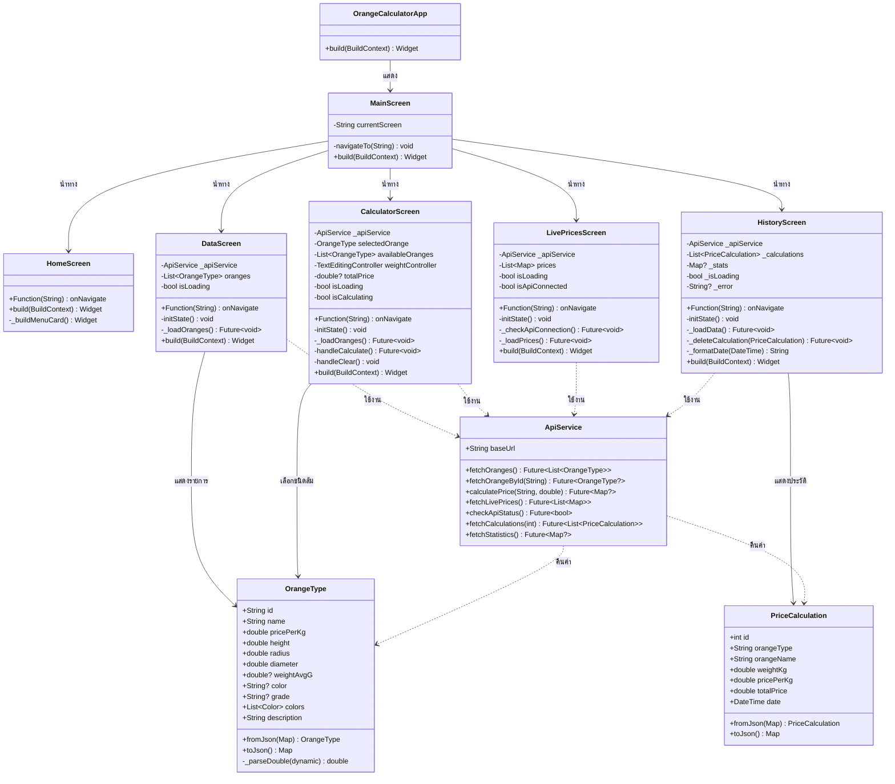

# Class Diagram - Orange Calculator App

## 2.1. ภาพรวมระบบ

ระบบ Orange Calculator App เป็นแอปพลิเคชัน Flutter สำหรับจัดการข้อมูลและคำนวณราคาผลส้ม ประกอบด้วยส่วนหลัก 4 ส่วน:

### 2.1.1. Screen Layer (ชั้นการแสดงผล)
คลาสสำหรับการแสดงผลหน้าจอต่างๆ ของแอปพลิเคชัน โดยแต่ละ Screen จะรับผิดชอบการแสดงผลและโต้ตอบกับผู้ใช้

- **HomeScreen**: หน้าจอหลักที่แสดงเมนูและภาพรวมของระบบ มีปุ่มนำทางไปยังหน้าต่างๆ
- **DataScreen**: หน้าจอแสดงข้อมูลส้มทุกชนิดพร้อมรายละเอียด เช่น ราคา ขนาด คำอธิบาย
- **CalculatorScreen**: หน้าจอสำหรับคำนวณราคาส้มตามน้ำหนัก ให้ผู้ใช้เลือกชนิดส้มและกรอกน้ำหนัก
- **LivePricesScreen**: หน้าจอแสดงราคาส้มแบบเรียลไทม์จาก API ที่ดึงข้อมูลจากเว็บไซต์ตลาดไทย
- **HistoryScreen**: หน้าจอแสดงประวัติการคำนวณและสถิติการใช้งาน

### 2.1.2. Model Layer (ชั้นข้อมูล)
คลาสที่เก็บข้อมูลและโครงสร้างข้อมูลของแอปพลิเคชัน

- **OrangeType**: คลาสที่เก็บข้อมูลชนิดของส้ม ประกอบด้วย id, ชื่อ (name), ราคาต่อกิโลกรัม (pricePerKg), ขนาด (height, radius, diameter), น้ำหนักเฉลี่ย (weightAvgG), สี (color), เกรด (grade), และคำอธิบาย (description) รวมถึงฟังก์ชัน fromJson และ toJson สำหรับแปลงข้อมูล JSON
- **PriceCalculation**: คลาสที่เก็บข้อมูลการคำนวณราคา ประกอบด้วย id, ชนิดส้ม (orangeType), ชื่อส้ม (orangeName), น้ำหนัก (weightKg), ราคาต่อกิโลกรัม (pricePerKg), ราคารวม (totalPrice), และวันที่ (date)

### 2.1.3. Service Layer (ชั้นบริการ)
คลาส Service ที่ทำหน้าที่เชื่อมต่อกับ Backend API

- **ApiService**: คลาส Service ที่จัดการการเชื่อมต่อกับ Backend API เพื่อดึงข้อมูลส้ม (fetchOranges), คำนวณราคา (calculatePrice), ดึงราคาแบบเรียลไทม์ (fetchLivePrices), ดึงประวัติการคำนวณ (fetchCalculations), และดึงสถิติ (fetchStatistics)

### 2.1.4. ความสัมพันธ์ระหว่าง Class

- **Screen → Service**: ทุก Screen ที่ต้องการข้อมูลจะมี ApiService เป็น attribute และเรียกใช้งาน
- **Service → Model**: ApiService จะคืนค่าเป็น OrangeType และ PriceCalculation
- **Screen → Model**: Screen ใช้ Model เพื่อแสดงผลและจัดการข้อมูล

## 2.2. Class Diagram



## 2.3. คำอธิบายแต่ละ Class โดยละเอียด

### 2.3.1. Model Classes

#### OrangeType
คลาสที่เก็บข้อมูลชนิดของส้ม มี attributes และ methods ดังนี้:

**Attributes:**
- `id`: รหัสอ้างอิงชนิดส้ม (String)
- `name`: ชื่อชนิดส้ม เช่น "ส้มโอ", "ส้มเขียวหวาน" (String)
- `pricePerKg`: ราคาต่อกิโลกรัม เช่น 45.0 บาท (double)
- `height`, `radius`, `diameter`: ขนาดของส้มเป็นเซนติเมตร (double)
- `weightAvgG`: น้ำหนักเฉลี่ยของส้ม 1 ผลเป็นกรัม (double?)
- `color`: สีของส้ม เช่น "orange", "green" (String?)
- `grade`: เกรดคุณภาพของส้ม เช่น "A", "B" (String?)
- `colors`: รายการสี Flutter Color สำหรับแสดง UI (List<Color>)
- `description`: คำอธิบายเพิ่มเติมเกี่ยวกับส้ม (String)

**Methods:**
- `fromJson(Map)`: สร้าง OrangeType object จาก JSON data ที่ได้จาก API
- `toJson()`: แปลง OrangeType object เป็น JSON format
- `_parseDouble(dynamic)`: แปลงค่าต่างๆ เป็น double (private helper method)

#### PriceCalculation
คลาสที่เก็บข้อมูลการคำนวณราคา:

**Attributes:**
- `id`: รหัสการคำนวณในฐานข้อมูล (int)
- `orangeType`: รหัสชนิดส้มที่ใช้คำนวณ (String)
- `orangeName`: ชื่อส้มที่ใช้คำนวณ (String)
- `weightKg`: น้ำหนักที่ใช้คำนวณเป็นกิโลกรัม (double)
- `pricePerKg`: ราคาต่อกิโลกรัมที่ใช้คำนวณ (double)
- `totalPrice`: ราคารวมที่คำนวณได้ (double)
- `date`: วันที่และเวลาที่ทำการคำนวณ (DateTime)

**Methods:**
- `fromJson(Map)`: สร้าง PriceCalculation object จาก JSON
- `toJson()`: แปลง PriceCalculation object เป็น JSON

### 2.3.2. Service Classes

#### ApiService
คลาสจัดการการเชื่อมต่อกับ Backend API:

**Attributes:**
- `baseUrl`: URL ของ Backend API (http://localhost:8001 หรือ http://10.0.2.2:8001 สำหรับ Android Emulator)

**Methods:**
- `fetchOranges()`: ดึงข้อมูลส้มทั้งหมดจาก API → Future<List<OrangeType>>
- `fetchOrangeById(String)`: ดึงข้อมูลส้มตาม ID → Future<OrangeType?>
- `calculatePrice(String, double)`: ส่งข้อมูลไปคำนวณราคา → Future<Map?>
- `fetchLivePrices()`: ดึงราคาแบบเรียลไทม์จากการ web scraping → Future<List<Map>>
- `checkApiStatus()`: ตรวจสอบว่า API ทำงานหรือไม่ → Future<bool>
- `fetchCalculations(int)`: ดึงประวัติการคำนวณล่าสุด → Future<List<PriceCalculation>>
- `fetchStatistics()`: ดึงข้อมูลสถิติการใช้งาน → Future<Map?>

### 2.3.3. Screen Classes

#### HomeScreen
หน้าจอหลักแสดงเมนูหลักของแอป:

**Attributes:**
- `onNavigate`: ฟังก์ชัน callback สำหรับนำทางไปหน้าอื่น (Function(String))

**Methods:**
- `build(BuildContext)`: สร้าง UI หน้าจอหลัก
- `_buildMenuCard()`: สร้าง menu card สำหรับแต่ละฟีเจอร์ (private helper)

**หน้าที่:**
- แสดงรูปภาพส้มและข้อความต้อนรับ
- แสดงจำนวนชนิดส้มทั้งหมด
- แสดงปุ่มเมนูนำทางไปยังหน้าต่างๆ (ข้อมูล, คำนวณ, ราคาเรียลไทม์, ประวัติ)

#### DataScreen
หน้าจอแสดงข้อมูลส้มทุกชนิด:

**Attributes:**
- `onNavigate`: ฟังก์ชันนำทาง
- `_apiService`: instance ของ ApiService สำหรับเรียก API
- `oranges`: รายการส้มทั้งหมดที่ดึงมา (List<OrangeType>)
- `isLoading`: สถานะการโหลดข้อมูล true/false (bool)

**Methods:**
- `initState()`: เริ่มต้น state และเรียก _loadOranges()
- `_loadOranges()`: โหลดข้อมูลส้มจาก API ด้วย ApiService
- `build(BuildContext)`: สร้าง UI แสดงรายการส้มเป็น Grid หรือ List

**หน้าที่:**
- แสดงรายการส้มทั้งหมดพร้อมรูปภาพและรายละเอียด
- แสดง loading indicator ขณะรอข้อมูล
- แสดงราคา ขนาด น้ำหนัก และคำอธิบายของแต่ละชนิด

#### CalculatorScreen
หน้าจอคำนวณราคาส้ม:

**Attributes:**
- `onNavigate`: ฟังก์ชันนำทาง
- `_apiService`: instance ของ ApiService
- `selectedOrange`: ส้มที่ผู้ใช้เลือกปัจจุบัน (OrangeType)
- `availableOranges`: รายการส้มที่สามารถเลือกได้ทั้งหมด
- `weightController`: TextEditingController สำหรับ input น้ำหนัก
- `totalPrice`: ราคารวมที่คำนวณได้ (double?)
- `isLoading`: สถานะการโหลดข้อมูลส้ม (bool)
- `isCalculating`: สถานะการคำนวณ (bool)

**Methods:**
- `initState()`: เริ่มต้น state และโหลดข้อมูลส้ม
- `_loadOranges()`: โหลดรายการส้มจาก API
- `handleCalculate()`: คำนวณราคาโดยเรียก API และแสดงผลลัพธ์
- `handleClear()`: ล้างข้อมูลที่กรอกและผลลัพธ์
- `build(BuildContext)`: สร้าง UI พร้อม dropdown เลือกส้ม, input น้ำหนัก, และแสดงผลลัพธ์

**หน้าที่:**
- ให้ผู้ใช้เลือกชนิดส้มจาก dropdown
- รับน้ำหนักที่ต้องการคำนวณ
- คำนวณราคาและแสดงผลลัพธ์พร้อมรายละเอียด
- บันทึกประวัติการคำนวณไปยัง backend

#### LivePricesScreen
หน้าจอแสดงราคาแบบเรียลไทม์:

**Attributes:**
- `onNavigate`: ฟังก์ชันนำทาง
- `_apiService`: instance ของ ApiService
- `prices`: รายการราคาปัจจุบันที่ดึงมา (List<Map>)
- `isLoading`: สถานะการโหลดข้อมูล (bool)
- `isApiConnected`: สถานะการเชื่อมต่อ API (bool)

**Methods:**
- `initState()`: เริ่มต้น state และตรวจสอบการเชื่อมต่อ
- `_checkApiConnection()`: ตรวจสอบว่า API ทำงานหรือไม่
- `_loadPrices()`: โหลดราคาเรียลไทม์จาก API (web scraping)
- `build(BuildContext)`: สร้าง UI แสดงรายการราคา

**หน้าที่:**
- แสดงราคาส้มจากเว็บไซต์ตลาดไทยแบบเรียลไทม์
- อัพเดทราคาให้เป็นปัจจุบัน
- แสดงช่วงราคา (ต่ำสุด-สูงสุด) และหน่วย

#### HistoryScreen
หน้าจอแสดงประวัติการคำนวณและสถิติ:

**Attributes:**
- `onNavigate`: ฟังก์ชันนำทาง
- `_apiService`: instance ของ ApiService
- `_calculations`: รายการประวัติการคำนวณทั้งหมด (List<PriceCalculation>)
- `_stats`: ข้อมูลสถิติ เช่น ยอดรวม จำนวนครั้ง (Map?)
- `_isLoading`: สถานะการโหลดข้อมูล (bool)
- `_error`: ข้อความ error หากเกิดปัญหา (String?)

**Methods:**
- `initState()`: เริ่มต้น state และโหลดข้อมูล
- `_loadData()`: โหลดประวัติและสถิติจาก API
- `_deleteCalculation(PriceCalculation)`: ลบประวัติการคำนวณ พร้อม undo
- `_formatDate(DateTime)`: จัดรูปแบบวันที่เป็นภาษาไทย
- `build(BuildContext)`: สร้าง UI แสดงประวัติและสถิติ

**หน้าที่:**
- แสดงประวัติการคำนวณทั้งหมดเรียงตามวันที่
- แสดงสถิติ เช่น จำนวนครั้งที่คำนวณ, ยอดรวม
- รองรับการลบประวัติพร้อมฟังก์ชัน undo
- แสดงรายละเอียดแต่ละครั้งที่คำนวณ (ชนิด, น้ำหนัก, ราคา, วันที่)

## 2.4. การทำงานร่วมกันของ Classes

### 2.4.1. การโหลดข้อมูล (Data Loading Flow)
```
1. Screen (เช่น DataScreen) → initState()
2. เรียก _loadOranges()
3. _loadOranges() → ApiService.fetchOranges()
4. ApiService ส่ง HTTP GET request → Backend API
5. Backend ส่งข้อมูล JSON กลับมา
6. ApiService แปลง JSON → List<OrangeType> ด้วย fromJson()
7. Screen รับข้อมูลและ setState()
8. UI อัพเดทแสดงข้อมูลใหม่
```

### 2.4.2. การคำนวณราคา (Price Calculation Flow)
```
1. ผู้ใช้เลือกชนิดส้มใน CalculatorScreen
2. ผู้ใช้กรอกน้ำหนัก (เช่น 2.5 กก.)
3. กดปุ่ม "คำนวณ"
4. handleCalculate() → ApiService.calculatePrice(orangeId, weight)
5. ApiService ส่ง POST request พร้อมข้อมูล → Backend
6. Backend คำนวณ: totalPrice = weight × pricePerKg
7. Backend บันทึกลงฐานข้อมูล (PriceCalculation record)
8. Backend ส่งผลลัพธ์ JSON กลับมา
9. CalculatorScreen รับและ setState(totalPrice)
10. แสดงผลราคารวมบนหน้าจอ
```

### 2.4.3. การแสดงประวัติ (History Display Flow)
```
1. HistoryScreen → initState() → _loadData()
2. เรียก ApiService.fetchCalculations(limit: 100)
3. ApiService ส่ง GET request → Backend
4. Backend query ฐานข้อมูล → ดึง PriceCalculation records
5. Backend ส่ง JSON array กลับมา
6. ApiService แปลง → List<PriceCalculation> ด้วย fromJson()
7. _loadData() เรียก ApiService.fetchStatistics()
8. Backend คำนวณสถิติ (sum, count, average)
9. HistoryScreen รับข้อมูลและ setState()
10. แสดงรายการประวัติและสถิติบนหน้าจอ
```

### 2.4.4. Error Handling และ Fallback
- เมื่อ API ไม่ตอบสนอง: ApiService ใช้ข้อมูล local (orangeTypes) แทน
- เมื่อเกิด error: แสดงข้อความแจ้งเตือนผู้ใช้
- Loading states: แสดง CircularProgressIndicator ระหว่างรอข้อมูล
- Validation: ตรวจสอบ input ก่อนส่งไป API

## 2.5. สรุป

ระบบ Orange Calculator App ออกแบบโดยแยก concern ของแต่ละส่วนอย่างชัดเจน:

- **Screens (Presentation Layer)** 
  - รับผิดชอบ UI และ interaction กับผู้ใช้
  - จัดการ local state (loading, selected items, input)
  - แสดงผลข้อมูลที่ได้จาก Service

- **Models (Data Layer)** 
  - เก็บโครงสร้างข้อมูลและ business logic
  - จัดการการแปลงข้อมูล (JSON ↔ Object)
  - เป็น single source of truth สำหรับข้อมูล

- **Services (Business Logic Layer)** 
  - จัดการการเชื่อมต่อกับ Backend API
  - ทำหน้าที่เป็น repository สำหรับข้อมูล
  - จัดการ error handling และ fallback

การออกแบบแบบนี้ทำให้:
- ✅ **โค้ดมีความเป็นระเบียบ** - แต่ละ class มีหน้าที่ชัดเจน  
- ✅ **ง่ายต่อการดูแลรักษา** - แก้ไข 1 จุดไม่กระทบส่วนอื่น  
- ✅ **สามารถขยายฟีเจอร์ได้ง่าย** - เพิ่ม screen หรือ model ใหม่ได้สะดวก  
- ✅ **ทดสอบได้ง่าย** - แต่ละส่วนสามารถ test แยกกันได้  
- ✅ **Reusable** - Service และ Model ใช้ซ้ำได้หลาย screen
