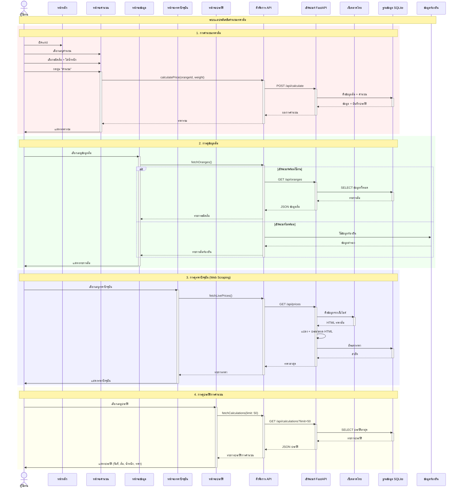

# แผนภาพลำดับการทำงาน - แอปคำนวณราคาส้ม

## แผนภาพรวมระบบทั้งหมด

## จุดสำคัญ

1. **การทำงานแบบอะซิงโครนัส**: ทุก API call ใช้ async/await pattern
2. **การจัดการข้อผิดพลาด**: มีระบบสำรองใช้ข้อมูลท้องถิ่นเมื่อเซิร์ฟเวอร์ไม่พร้อม
3. **การจัดการสถานะ**: ใช้ setState() สำหรับอัพเดท UI
4. **การบันทึกข้อมูล**: บันทึกทุกการคำนวณลงฐานข้อมูล SQLite
5. **การดึงข้อมูลจากเว็บ**: ดึงราคาจากเว็บตลาดไทยแบบเรียลไทม์
6. **สถาปัตยกรรม**: แยก UI, API Service, Backend และ Database ชัดเจน
7. **การทำงานแบบ Real-time**: อัพเดทราคาจากแหล่งภายนอกและบันทึกลงฐานข้อมูล
8. **ประสบการณ์ผู้ใช้**: มี Loading indicators และ Error messages ที่ชัดเจน
