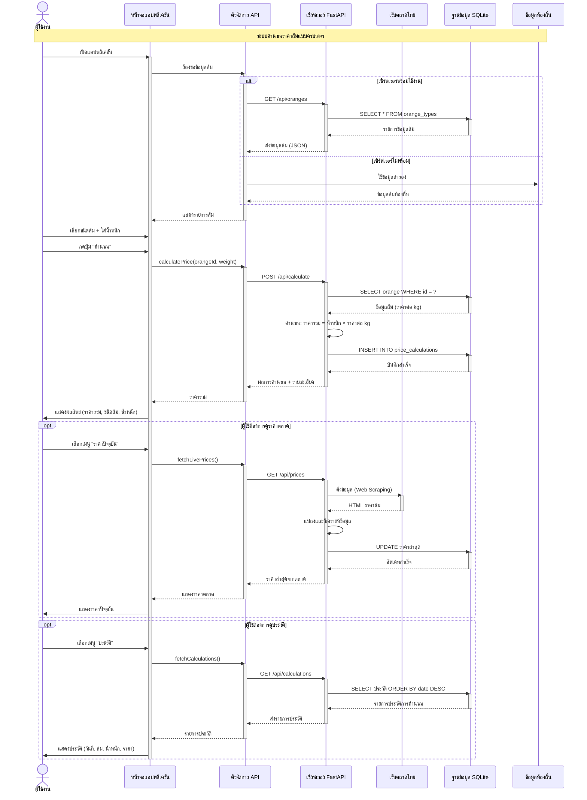

# แผนภาพลำดับการทำงาน - แอปคำนวณราคาส้ม

## 2.2. Sequence Diagram (การทำงานร่วมกันของระบบ)

### 2.2.1. กระบวนการ
แสดงลำดับการโต้ตอบและรับส่งข้อมูลระหว่างส่วนติดต่อผู้ใช้ (Frontend: Flutter App) และระบบประมวลผลเบื้องหลัง (Backend: FastAPI) โดยเริ่มต้นเมื่อผู้ใช้ทำการเลือกชนิดส้มและระบุน้ำหนักผ่านแอปพลิเคชัน ระบบจะส่งข้อมูลไปยังเซิร์ฟเวอร์เพื่อทำการคำนวณราคาจากฐานข้อมูล เมื่อเสร็จสิ้น Backend จะส่งผลลัพธ์กลับมาเพื่อแสดงราคารวมและรายละเอียดการคำนวณที่หน้าจอของผู้ใช้งาน นอกจากนี้ระบบยังรองรับการดึงราคาจากเว็บตลาดไทยแบบเรียลไทม์ และมีระบบสำรองข้อมูลท้องถิ่นสำหรับการใช้งานแบบออฟไลน์

### 2.2.2. Data Flow

#### 2.2.2.1. Request
มีการระบุรูปแบบคำขอที่สำคัญ ได้แก่:
- **POST /api/calculate**: ส่งพารามิเตอร์ orange_id (รหัสชนิดส้ม) และ weight (น้ำหนักเป็น kg) ไปยังเซิร์ฟเวอร์เพื่อทำการคำนวณราคา
- **GET /api/oranges**: ดึงข้อมูลส้มทั้งหมดจากฐานข้อมูล รวมถึงราคาต่อ kg และรายละเอียดต่างๆ
- **GET /api/prices**: ดึงราคาปัจจุบันจากเว็บตลาดไทยผ่าน Web Scraping
- **GET /api/calculations**: ดึงประวัติการคำนวณย้อนหลังจากฐานข้อมูล

#### 2.2.2.2. Response
ระบบตอบกลับในรูปแบบ JSON ซึ่งบรรจุข้อมูลสรุปผลการคำนวณ ได้แก่:
- **orange_id และ orange_name**: รหัสและชื่อชนิดส้มที่เลือก
- **weight**: น้ำหนักที่ระบุ (kg)
- **price_per_kg**: ราคาต่อกิโลกรัม (บาท)
- **total_price**: ราคารวมที่คำนวณได้ (บาท)
- **calculation_id**: รหัสอ้างอิงการคำนวณ
- **timestamp**: เวลาที่ทำการคำนวณ

ข้อมูลเหล่านี้จะถูกนำไปแสดงผลบนหน้าจอและบันทึกลงฐานข้อมูล SQLite เพื่อสามารถดูประวัติย้อนหลังได้

---

## คำอธิบาย

แผนภาพนี้แสดงการทำงานหลักของระบบแอปคำนวณราคาส้มแบบครบวงจร ประกอบด้วย:

### ส่วนประกอบหลัก
- **ผู้ใช้งาน**: นักวิจัย/ผู้ใช้แอปพลิเคชัน
- **หน้าจอแอป**: ส่วนติดต่อผู้ใช้ (Flutter UI)
- **ตัวจัดการ API**: จัดการการเชื่อมต่อและดึงข้อมูล
- **เซิร์ฟเวอร์**: Backend FastAPI ประมวลผลข้อมูล
- **เว็บตลาดไทย**: แหล่งข้อมูลราคาตลาดภายนอก
- **ฐานข้อมูล**: SQLite เก็บข้อมูลส้มและประวัติ
- **ข้อมูลท้องถิ่น**: ข้อมูลสำรองเมื่อออฟไลน์

### การทำงานหลัก

1. **ดึงข้อมูลส้ม**: เมื่อเปิดแอป ระบบจะดึงข้อมูลส้มจากเซิร์ฟเวอร์ หากเซิร์ฟเวอร์ไม่พร้อมจะใช้ข้อมูลท้องถิ่นแทน

2. **คำนวณราคา**: ผู้ใช้เลือกชนิดส้มและใส่น้ำหนัก ระบบจะ:
   - ดึงข้อมูลราคาต่อ kg จากฐานข้อมูล
   - คำนวณราคารวม (น้ำหนัก × ราคาต่อ kg)
   - บันทึกประวัติการคำนวณ
   - แสดงผลลัพธ์ให้ผู้ใช้

3. **ดูราคาปัจจุบัน** (ตัวเลือก): ผู้ใช้สามารถดูราคาตลาดล่าสุดได้ ระบบจะ:
   - ดึงข้อมูลจากเว็บตลาดไทย (Web Scraping)
   - วิเคราะห์และอัพเดทราคาในฐานข้อมูล
   - แสดงราคาล่าสุดจากตลาด

4. **ดูประวัติ** (ตัวเลือก): ผู้ใช้สามารถดูประวัติการคำนวณย้อนหลัง แสดงวันที่, ชนิดส้ม, น้ำหนัก และราคา

### จุดเด่น
- ✅ มีระบบสำรอง (Fallback) เมื่อออฟไลน์
- ✅ บันทึกประวัติทุกครั้งที่คำนวณ
- ✅ ดึงราคาจากตลาดแบบเรียลไทม์
- ✅ การทำงานแบบ Asynchronous
- ✅ สถาปัตยกรรมแบบแยกชั้น (Layered Architecture)
