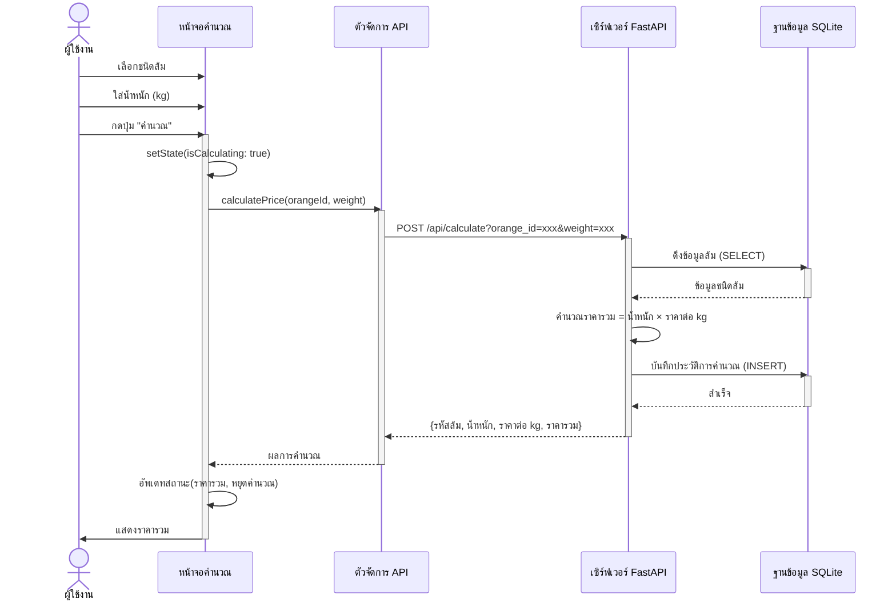
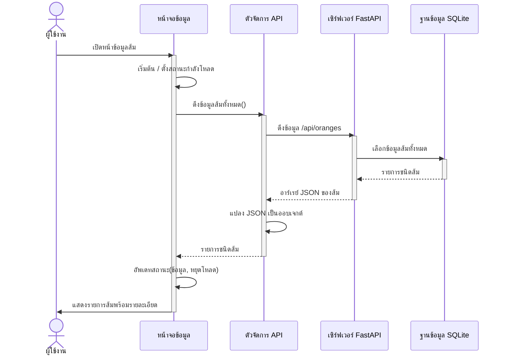
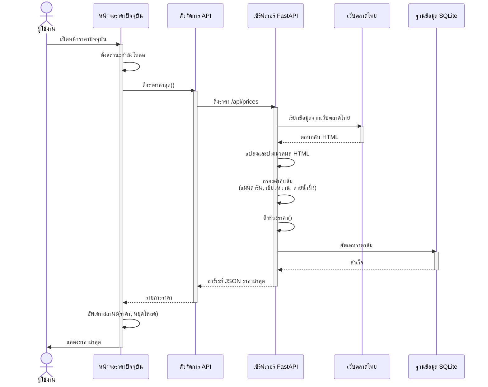
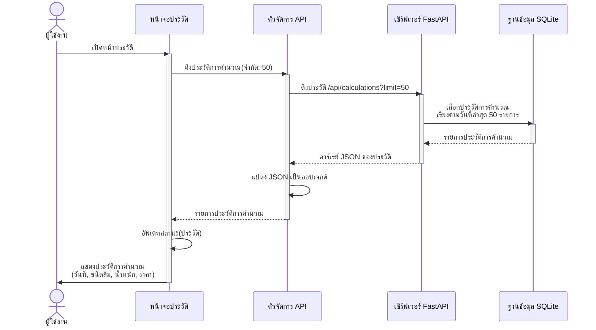
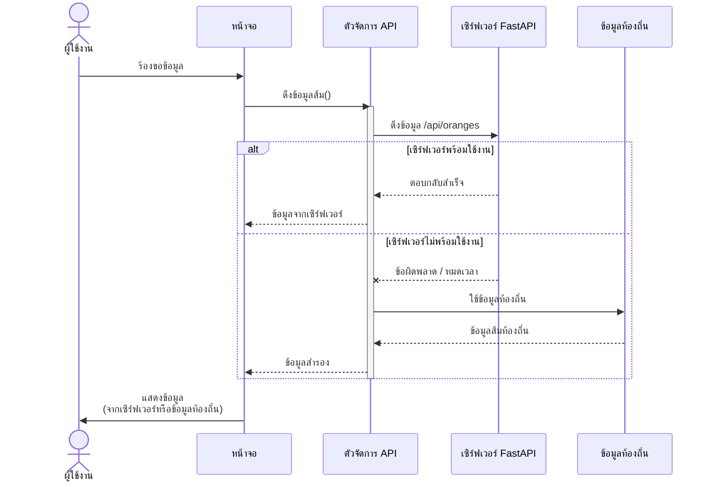

# แผนภาพลำดับการทำงาน (Sequence Diagrams) - แอปคำนวณราคาส้ม

## 1. แผนภาพลำดับ: คำนวณราคาส้ม

## 2. แผนภาพลำดับ: ดูข้อมูลส้ม

## 3. แผนภาพลำดับ: ดูราคาปัจจุบัน (ดึงจากเว็บไซต์)

## 4. แผนภาพลำดับ: ดูประวัติการคำนวณ

## 5. แผนภาพลำดับ: การจัดการข้อผิดพลาดและระบบสำรอง

## จุดสำคัญ

1. **การทำงานแบบอะซิงโครนัส**: ทุก API call ใช้ async/await pattern
2. **การจัดการข้อผิดพลาด**: มีระบบสำรองใช้ข้อมูลท้องถิ่นเมื่อเซิร์ฟเวอร์ไม่พร้อม
3. **การจัดการสถานะ**: ใช้ setState() สำหรับอัพเดท UI
4. **การบันทึกข้อมูล**: บันทึกทุกการคำนวณลงฐานข้อมูล SQLite
5. **การดึงข้อมูลจากเว็บ**: ดึงราคาจากเว็บตลาดไทยแบบเรียลไทม์
