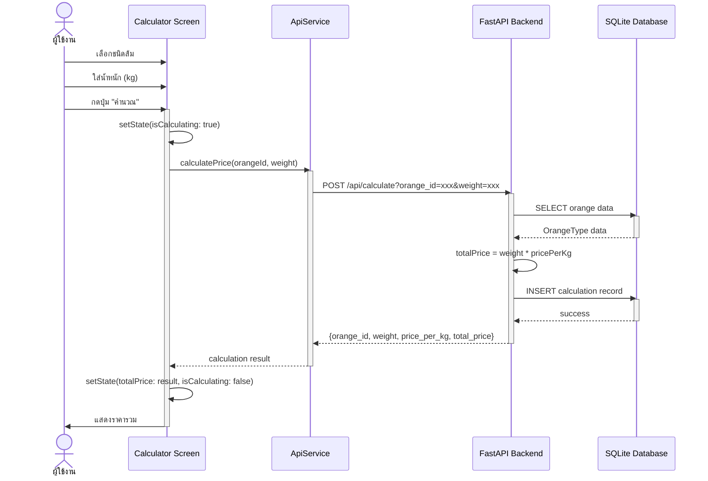
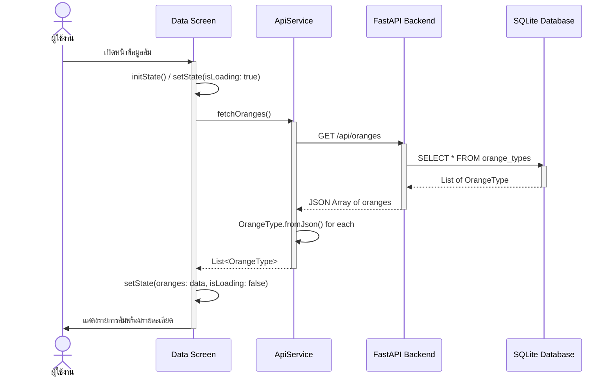
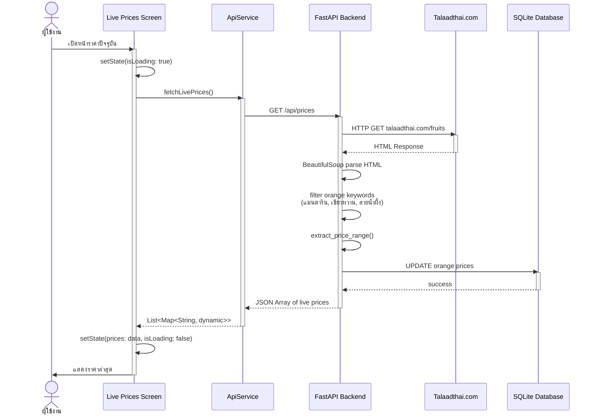
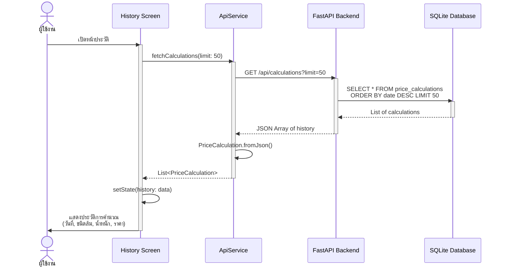
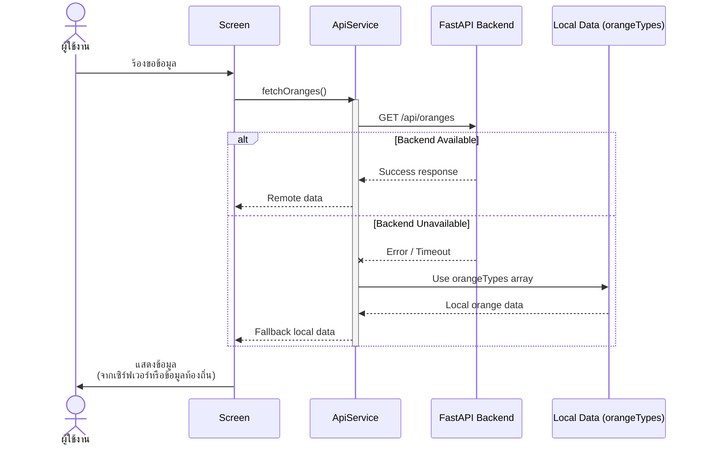

# Sequence Diagrams - Orange Calculator App

## 1. Sequence Diagram: คำนวณราคาส้ม (Calculate Orange Price)

## 2. Sequence Diagram: ดูข้อมูลส้ม (Fetch Orange Data)

## 3. Sequence Diagram: ดูราคาปัจจุบัน (Live Prices from Web Scraping)

## 4. Sequence Diagram: ดูประวัติการคำนวณ (View History)

## 5. Sequence Diagram: Error Handling with Fallback

## Key Points

1. **Asynchronous Operations**: ทุก API call ใช้ async/await pattern
2. **Error Handling**: มี fallback ไปใช้ข้อมูลท้องถิ่นเมื่อ Backend ไม่พร้อม
3. **State Management**: ใช้ setState() สำหรับอัพเดท UI
4. **Database Persistence**: บันทึกทุกการคำนวณลง SQLite
5. **Web Scraping**: ดึงราคาจาก Talaadthai.com แบบ real-time
