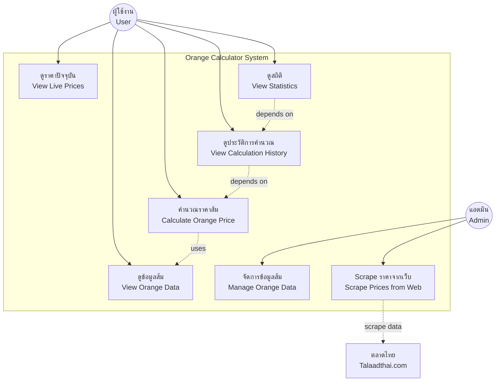

# Use Case Diagram - Orange Calculator App

## Use Cases Description

### 1. ดูข้อมูลส้ม (View Orange Data)
**Actor:** ผู้ใช้งาน (User)  
**Description:** ผู้ใช้สามารถดูข้อมูลส้มแต่ละชนิด รวมถึงราคา น้ำหนัก ขนาด และคุณสมบัติต่างๆ  
**Preconditions:** ผู้ใช้เปิดแอปพลิเคชัน  
**Postconditions:** แสดงรายการส้มพร้อมข้อมูลรายละเอียด

### 2. คำนวณราคาส้ม (Calculate Orange Price)
**Actor:** ผู้ใช้งาน (User)  
**Description:** ผู้ใช้เลือกชนิดส้มและใส่น้ำหนัก ระบบจะคำนวณราคารวม  
**Preconditions:** มีข้อมูลส้มในระบบ  
**Postconditions:** แสดงราคารวมและบันทึกประวัติการคำนวณ

### 3. ดูราคาปัจจุบัน (View Live Prices)
**Actor:** ผู้ใช้งาน (User)  
**Description:** ดูราคาส้มปัจจุบันที่ดึงมาจาก Talaadthai.com  
**Preconditions:** มีการเชื่อมต่อ Backend API  
**Postconditions:** แสดงราคาล่าสุดของส้มแต่ละชนิด

### 4. ดูประวัติการคำนวณ (View Calculation History)
**Actor:** ผู้ใช้งาน (User)  
**Description:** ดูประวัติการคำนวณราคาที่ผ่านมา  
**Preconditions:** มีการคำนวณราคาอย่างน้อย 1 ครั้ง  
**Postconditions:** แสดงรายการประวัติพร้อมวันที่และราคา

### 5. ดูสถิติ (View Statistics)
**Actor:** ผู้ใช้งาน (User)  
**Description:** ดูสถิติการคำนวณ เช่น ส้มที่นิยม จำนวนการคำนวณ ฯลฯ  
**Preconditions:** มีประวัติการคำนวณ  
**Postconditions:** แสดงข้อมูลสถิติในรูปแบบกราฟและตาราง

### 6. จัดการข้อมูลส้ม (Manage Orange Data)
**Actor:** แอดมิน (Admin)  
**Description:** เพิ่ม แก้ไข หรือลบข้อมูลส้มในระบบ  
**Preconditions:** เข้าสู่ระบบด้วยสิทธิ์แอดมิน  
**Postconditions:** ข้อมูลส้มในฐานข้อมูลได้รับการอัพเดต

### 7. Scrape ราคาจากเว็บ (Scrape Prices from Web)
**Actor:** แอดมิน (Admin), External System (Talaadthai.com)  
**Description:** ดึงข้อมูลราคาส้มจาก Talaadthai.com อัตโนมัติ  
**Preconditions:** API Backend ทำงาน, เว็บ Talaadthai.com เข้าถึงได้  
**Postconditions:** ข้อมูลราคาในฐานข้อมูลได้รับการอัพเดต
